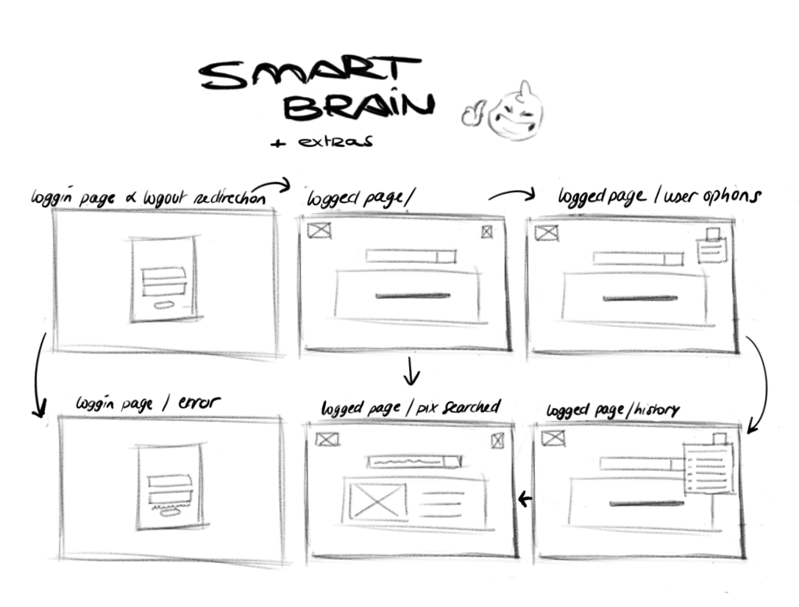

## Final Project - Smart brain 
Smart Brain project purposes it to do a fullstack web app page.
The project is about detecting face ( or else ) within a given picture given.

## Implementation details
<ul>
	<li>asynchronous</li>
	<li>javascript</li>
	<li>front end</li>
	<ul>
		<li>react</li>
		<li>API Clarifai</li>
		<li>library particle</li>
		<li>library tilt</li>
	</ul>
	<li>back end</li>
	<ul>
		<li>node js</li>
		<li>express</li>
		<li>create API</li>
		<li>authentication</li>
</ul>

## Original project and the project appropriation (w/ extras)
### Original project
*(react component based, node, express, create react app)*
- login page 
- logged page
	- input to paste a picture url
	- input submitting the picture to deduct details using clarifai API
	- button logout

---- 
### Project Appropriation
*(react component based, node, express, create react app)*

---- 
## Packages 
- [tilt effect](https://www.npmjs.com/package/particles-bg) : ``
- [particles background effect](https://www.npmjs.com/package/particles-bg)
- clarifai

## Credits
- icon logo: Alzheimer by Victoruler from 
<a href="https://thenounproject.com/browse/icons/term/alzheimer/" target="_blank" title="Alzheimer Icons">Noun Project (CC BY 3.0)</a>

Lens by Roundicons.com from <a href="https://thenounproject.com/browse/icons/term/lens/" target="_blank" title="Lens Icons">Noun Project (CC BY 3.0)</a>

Lens by Yayat Dayat from <a href="https://thenounproject.com/browse/icons/term/lens/" target="_blank" title="Lens Icons">Noun Project (CC BY 3.0)</a>